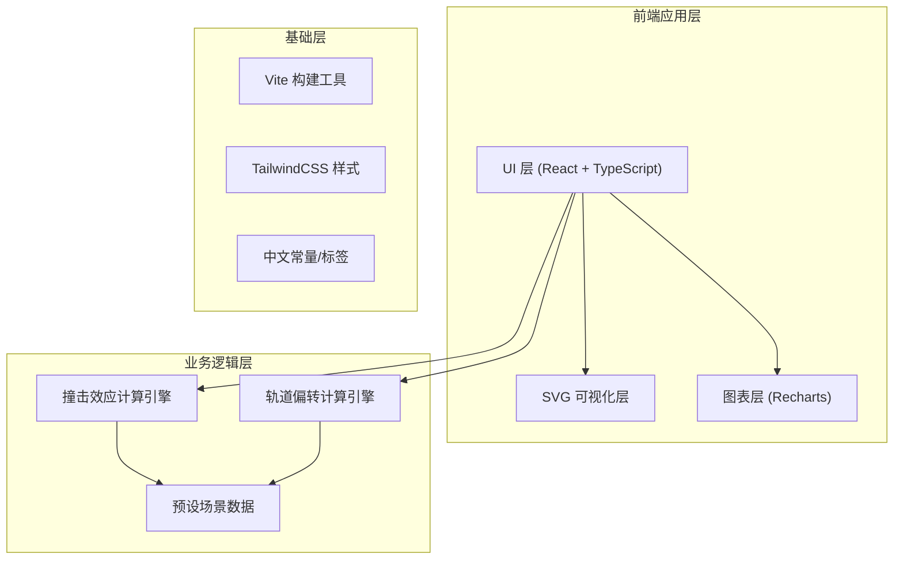

## 1. 架构设计



纯前端架构，无后端服务，所有物理计算在浏览器端完成。

## 2. 技术说明

- **前端框架**：React@18 + TypeScript
- **构建工具**：Vite
- **样式方案**：TailwindCSS@3
- **可视化**：SVG（影响范围图、轨道示意图）+ Recharts（delta-v 时间关系曲线图）
- **动画**：framer-motion（数值过渡、轨迹动画、页面切换）
- **路由**：React Router v6（首页 → 撞击推演 / 偏转推演）
- **后端**：无
- **数据库**：无（所有计算实时完成，预设场景硬编码）

## 3. 路由定义

| 路由 | 用途 |
|------|------|
| `/` | 首页，模式选择（撞击效应 / 轨道偏转） |
| `/impact` | 撞击效应推演页面 |
| `/deflection` | 轨道偏转推演页面 |

## 4. 核心物理公式

### 4.1 撞击效应计算

**撞击动能**：
- E = 0.5 × ρ × V × v²
- 其中 V = (4/3)π(D/2)³ 为体积，ρ 为密度，v 为撞击速度
- 换算：1 吨 TNT = 4.184×10⁹ J，广岛原子弹 ≈ 15 千吨 TNT

**撞击坑直径**（Pi-group scaling, Schmidt-Holsapple）：
- D_tc = 1.161 × (ρ_i/ρ_t)^(1/3) × D_i^0.78 × v^0.44 × g^(-0.22)
- 简化使用 Marcus et al. (2010) 的经验公式
- 最终坑直径考虑重力塌陷：D_final = 1.2 × D_tc（简单坑）或 1.2 × D_tc^(1.13)（复杂坑，D_tc > 3.2 km）

**地震震级**（Shoemaker, 1983）：
- M = 0.67 × log10(E_seismic) - 5.87
- E_seismic ≈ 10^(-4) × E_impact（地震效率约 10⁻⁴）

**热辐射**（Collins et al., 2005）：
- 火球半径：R_fireball ≈ 3.5 × E^(1/3)（E 单位 Mt TNT）
- 热通量随距离衰减：q = σT⁴ × (R_fireball/r)²
- 不同伤害阈值：1st degree burn ~ 4.2 J/cm², 2nd degree ~ 8.4 J/cm², 3rd degree ~ 12.6 J/cm²

**冲击波**（Glasstone & Dolan, 1977）：
- 超压随距离衰减关系
- 1 psi ≈ 6.9 kPa 破坏阈值：玻璃破碎 ~1 psi, 建筑部分损毁 ~4 psi, 建筑严重损毁 ~10 psi, 建筑摧毁 ~20 psi

### 4.2 轨道偏转计算

**偏移距离**（线性近似，Ahrens & Harris, 1992）：
- δ = Δv × t_remaining
- 其中 Δv 为速度增量，t_remaining 为距撞击的剩余时间
- 脱靶条件：δ > R_earth + R_atmosphere ≈ 6471 km

**所需 delta-v 与时间的关系**：
- Δv_min = (R_earth + 100 km) / t_remaining
- 体现越早干预所需 delta-v 越小

## 5. 数据模型

### 5.1 核心类型定义

```typescript
interface AsteroidParams {
  diameter: number;
  density: number;
  densityType: 'stony' | 'iron' | 'comet';
  velocity: number;
  angle: number;
}

interface ImpactResults {
  energyJoules: number;
  energyTNT: number;
  hiroshimaEquivalent: number;
  craterDiameter: number;
  earthquakeMagnitude: number;
  fireballRadius: number;
  thermalRadiation: ThermalZone[];
  blastWave: BlastZone[];
  disasterLevel: DisasterLevel;
}

interface DeflectionParams {
  asteroid: AsteroidParams;
  timeRemaining: number;
  deltaV: number;
}

interface DeflectionResults {
  missDistance: number;
  isSafe: boolean;
  requiredDeltaV: number;
  timeDeltaVRelation: Array<{time: number; deltaV: number}>;
}
```

### 5.2 预设场景

| 场景名称 | 直径 | 密度类型 | 速度 | 角度 |
|---------|------|---------|------|------|
| 通古斯事件 | 50m | 石质 | 20 km/s | 45° |
| 车里雅宾斯克 | 20m | 石质 | 19 km/s | 18° |
| 巴林杰陨石坑 | 50m | 铁质 | 13 km/s | 45° |
| 希克苏鲁伯撞击 | 10km | 石质 | 20 km/s | 45° |
| 恐龙灭绝事件 | 15km | 石质 | 20 km/s | 60° |

## 6. 项目目录结构

```
src/
├── components/
│   ├── common/           # 通用组件
│   │   ├── StarField.tsx         # 星空背景
│   │   └── DataCard.tsx          # 数据卡片
│   ├── impact/           # 撞击推演组件
│   │   ├── ImpactParams.tsx      # 参数面板
│   │   ├── ImpactResults.tsx     # 结果展示
│   │   ├── ImpactZoneSvg.tsx     # 影响范围SVG
│   │   └── PresetSelector.tsx    # 预设选择器
│   ├── deflection/       # 偏转推演组件
│   │   ├── DeflectionParams.tsx  # 偏转参数面板
│   │   ├── OrbitSvg.tsx         # 轨道示意图SVG
│   │   ├── MissIndicator.tsx    # 脱靶判定指示
│   │   └── TimeDeltaChart.tsx   # 时间-deltaV关系图
│   └── layout/
│       └── Navigation.tsx       # 导航组件
├── pages/
│   ├── Home.tsx                 # 首页
│   ├── ImpactPage.tsx           # 撞击推演页
│   └── DeflectionPage.tsx       # 偏转推演页
├── core/
│   ├── impactCalc.ts            # 撞击效应计算
│   ├── deflectionCalc.ts        # 轨道偏转计算
│   ├── constants.ts             # 物理常数
│   └── presets.ts               # 预设场景
├── types/
│   └── index.ts                 # TypeScript 类型定义
├── App.tsx
└── main.tsx
```
